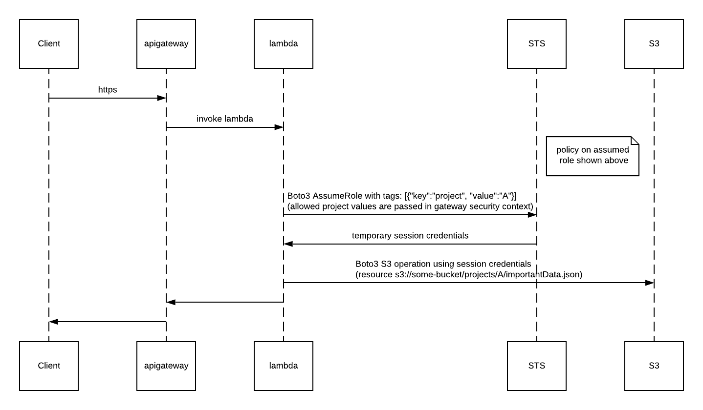

# iam-abac

Questsions:
* How frequently can we call STS assume role (the role session will likely only be used for a single operation before being discarded) 

## Policy
```json
{
    "Version": "2012-10-17",
    "Statement": [
        {
            "Effect": "Allow",
            "Action": [
                "s3:Get*",
                "s3:List*"
            ],
            "Resource": [
                "arn:aws:s3:::some-bucket",
                "arn:aws:s3:::some-bucket/projects/${aws:PrincipalTag/project}/*"
            ]
        }
    ]
}
```

## Sequence Diagram
